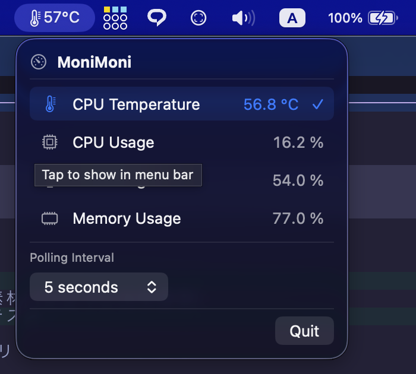

# MoniMoni

A lightweight native macOS menu bar app that monitors CPU, GPU, and memory.

It does not appear in the Dock — it lives only in the menu bar (`LSUIElement`).



## Features

- **Menu bar display**: Pick one metric to show at all times
- **Popup**: Click the menu bar item to see all metrics
- Metrics:
  - CPU temperature (via SMC)
  - CPU usage
  - GPU usage (when available)
  - Memory usage (percent)
- Remembers the selected metric and refresh interval (1 / 2 / 5 / 10 seconds) in `UserDefaults`

## Requirements

- macOS 14.0 or later
- Apple Silicon and Intel (sensor keys vary by machine)
- Xcode 16 recommended

## Install

Download the latest ZIP from
[GitHub Releases](https://github.com/shogoisaji/MoniMoni/releases), extract it,
and move `MoniMoni.app` to your Applications folder.

## Setup

The Xcode project is generated with [XcodeGen](https://github.com/yonaskolb/XcodeGen) from `project.yml`.

**Canonical source of truth:** edit **`project.yml`** for targets, settings, and sources. The checked-in `MoniMoni.xcodeproj` is a convenience snapshot so the repo opens in Xcode without regenerating; CI always runs `xcodegen generate` before build/test. After you change `project.yml` (or add/remove source files), run `xcodegen generate` again and commit both `project.yml` and the regenerated project if you keep the snapshot in git.

```bash
# Dependency
brew install xcodegen

# Generate project and open
xcodegen generate
open MoniMoni.xcodeproj
```

Press **Run** (⌘R) in Xcode. The app appears in the menu bar only (no Dock icon).

### Command-line build

```bash
xcodegen generate
xcodebuild -scheme MoniMoni -configuration Debug build
```

Signing and version defaults live in `Config/Shared.xcconfig`. Override them
locally by copying `Config/Local.xcconfig.example` to `Config/Local.xcconfig`
(gitignored).

### Tests

Unit tests use [Swift Testing](https://developer.apple.com/documentation/testing) under `MoniMoniTests/`.

```bash
xcodegen generate
xcodebuild -scheme MoniMoni -destination 'platform=macOS' \
  CODE_SIGN_IDENTITY="-" CODE_SIGNING_REQUIRED=NO test
```

In Xcode, use the **MoniMoni** scheme and **Test** (⌘U).

### CI

GitHub Actions (`.github/workflows/ci.yml`) runs `xcodegen generate` and `xcodebuild test` on macOS for `push` and `pull_request`.

### Release (maintainers)

Local release packaging mirrors CapMark: archive → Developer ID export →
notarize → ZIP (optional DMG) → optional GitHub Release upload.

**Prerequisites**

- Apple Developer Program membership
- `Developer ID Application` certificate in the login keychain
- notarytool keychain profile (default: `CapMarkNotary` — same team profile as CapMark; override with `NOTARY_KEYCHAIN_PROFILE`)

```bash
# One-time: store App Store Connect API credentials for notarization
# (reuse this profile for every app on the same Developer Team)
xcrun notarytool store-credentials CapMarkNotary \
  --apple-id "you@example.com" \
  --team-id "YOUR_TEAM_ID" \
  --password "app-specific-password"
```

**Commands**

```bash
# Build, sign, notarize, and write dist/MoniMoni-<version>.zip (+ .sha256)
scripts/release-local.sh 1.0.0

# Also produce a notarized DMG (requires: brew install create-dmg)
scripts/release-local.sh 1.0.0 --dmg

# Tag, push, and upload artifacts to GitHub Releases (clean git worktree + gh auth)
scripts/release-local.sh 1.0.0 --publish
# or both:
scripts/release-local.sh 1.0.0 --dmg --publish
```

Artifacts land in `dist/` (gitignored). Before publishing a new version, bump
`MARKETING_VERSION` in `Config/Shared.xcconfig` if you keep it as the project
default (the script also passes the CLI version into the archive).

## Security and privacy

MoniMoni is designed for **local, offline** monitoring:

| Topic | Detail |
|--------|--------|
| Network | No network access; no analytics, accounts, or remote endpoints |
| Data stored | Only UI preferences in `UserDefaults` (selected metric, refresh interval) |
| Sensors read | CPU load, memory pressure (percent only), optional GPU utilization via IOKit, optional CPU temperature via Apple SMC |
| Sandbox | **App Sandbox is disabled** so IOKit / SMC access can work. The app does not request Full Disk Access or other TCC privacy prompts |
| Hardened Runtime | Enabled in the project settings |

### Why sandbox is off and SMC is used

CPU temperature is read through **undocumented Apple SMC** interfaces (same general approach as many open-source hardware monitors). That path is not an App Store–approved public API, and a sandboxed app typically cannot open the SMC service reliably. GPU utilization comes from IOKit `PerformanceStatistics`, which also varies by machine and may be unavailable.

**Implications:**

- Prefer building from this repository or installing only binaries you trust.
- Sensor values can be wrong or missing depending on Mac model and macOS version; the UI shows `Unavailable` when a reading fails.
- Because of private/undocumented APIs and the disabled sandbox, this app is **not suitable for the Mac App Store**. It is intended for local use and open-source distribution.

If you find a security issue, please open a private report via GitHub security advisories (or an issue if advisories are unavailable) rather than posting exploit details publicly.

## Notes and limitations

- CPU temperature keys differ by model and OS; when unavailable, the UI shows `Unavailable`.
- GPU usage depends on IOKit `PerformanceStatistics` and may be unavailable on some machines.
- Memory is reported as a **percentage only** (not used/total bytes).
- UI language is **English** (`developmentLanguage: en`).

## License

[MIT License](LICENSE)

Use at your own risk. The author makes no guarantees about SMC-based sensor readings or fitness for any particular purpose.
